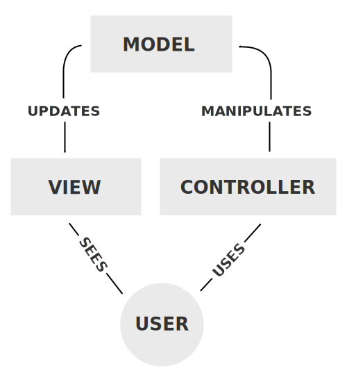

# example_mvc_python

[Model-View-Controller](https://en.wikipedia.org/wiki/Model%E2%80%93view%E2%80%93controller) (`mvc`) is a programming paradigm that enables separation of concerns when using a user interface (like a website or dashboard).

It divides the logic into three internal constructs, notably

1. Model: representations of information
2. View: presents information to and received information from the user
3. Controller: software linking the two

This example sets up an MVC framework using two currently common technologies, `python` and `react`.

---

Steps to install:

1. Before using this, have `python` and `npm` installed. At time of writing, the author has `python==3.10.11` and `npm==8.19.2`
2. Navigate your *sh shell to the `mvc`
3. Run `setup.sh` to create a local python virtual environment, set up local npm packages and copy `viewer.js` to `my-counter/src/App.js`
4. This will leave you in the `python` virtual environment named `example-mvc`. If in doubt, run `source ./example-mvc/bin/activate`. If it fails, installation failed.

Steps to run
1. Open two shells
2. In the first, navigate to `mvc`, then run `uvicorn controller:app --reload --port 8000`
3. In the second, navigate to `mvc/my-counter`, then run `npm start`

